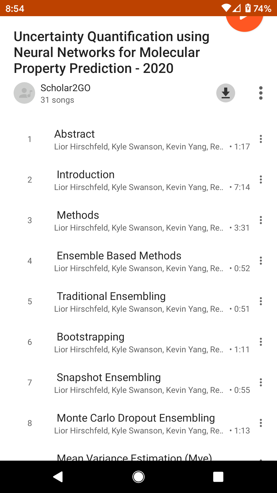

# Scholar 2 GO
Under Active Development

Scientific papers converted to audio files so they can be listened to while you're on the go! i.e. Commuting / Cooking / Cleaning / Exercising/ Etc. Pretrained Machine Learning models parse the PDF into sections and Pretrained Text-To-Speech models generate audio files for each section. You end up with an mp3 album where each audio track is a section of the paper and the album name is the name of the paper. It tries to skip over formulas/diagrams/tables. Even if the formulas could be parsed consistently, I Know I couldn't understand it by just listening anyway. Hopefully the audio files sans math and diagrams are enough to get the high level content so you know what to spend time on when you get to the lab/office. 
 
 All the heavy lifting is done by [Grobid](https://github.com/kermitt2/grobid) and [ESPNet](https://github.com/espnet/espnet) pre-trained models. Check them out!. This project just glues them together, adding some convenience. There is some extra stuff related to transforming GROBID XML into a text that can be readily read aloud. 
 
 # Screenshots Mp3 Albums on Mobile Device
 I sync the papers I want to listen to my google play music library. Here are screenshots from my mobile device. 
 
 

# Usage
For simplicity, you just run 2 docker containers. Grobid recommends 4Gb of RAM for full paper parsing  so running on a basic laptop can be problematics. Thats why this scholar2go has a service oriented architecture. You run 2 docker containers that start up services. If you got the RAM on your own machine, great, otherwise start it on a remote server and either tunnel in to the local hosts ports or expose the ports some other way. 

#### 2 Docker Containers to run
1. [Grobid](https://grobid.readthedocs.io/en/latest/Grobid-docker/)
2. Scholar2Go TODO: add usage docks

#### Option 1: https://localhost:tbd
Navigate to the localhost(TBD) web page where you can upload PDFs, download audio files and browse prior work. TODO Add GIFs of this in action
#### Option 2: ClientSide Directory Service
Use your OS scheduler to run the directory service at periodic intervals. You point it at an in and out directory + a config file. It then looks for new PDFs, passes them to the dockerized services and downloads / unzips the resulting PDFs and MP3s. 

###### Tip:
Get the audio files synced to a music app like google play music using [Google Play Music Manager](https://support.google.com/googleplaymusic/answer/1075570?visit_id=637252457142778970-366532791&rd=2)

 ### TTS
[ESPNet](https://github.com/espnet/espnet) has some great pretrained models but if you want a commercial alternative there is an option to provide your own Google API key or AWS Key and use their services. Please consider contributing to projects like [Common Voice](https://voice.mozilla.org/en) to improve the diversity of training examples for better open research into ASR and TTS.
